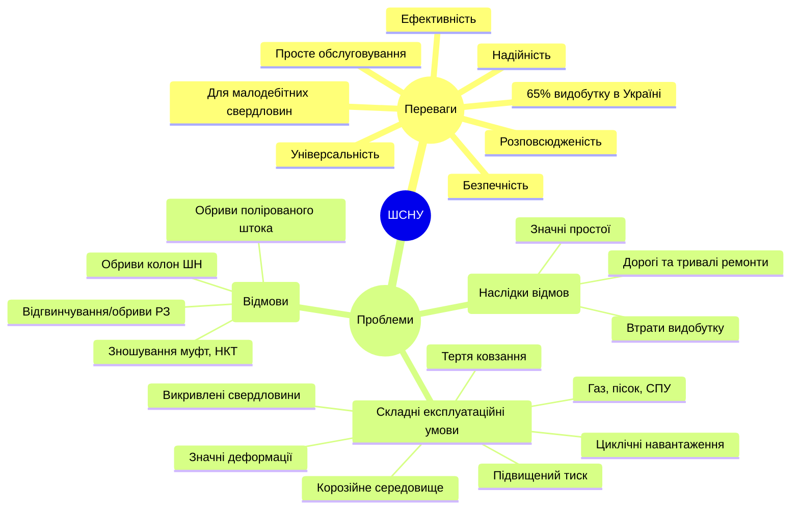

```mermaid
mindmap
 ((ШСНУ))
  ((Переваги))
    Розповсюдженість
    Ефективність
    Універсальність
    Надійність
    Безпечність
    Просте обслуговування
    Для малодебітних свердловин
    65% видобутку в Україні
  ((Проблеми))
    Складні експлуатаційні умови
      Циклічні навантаження
      Значні деформації
      Підвищений тиск
      Тертя ковзання
      Корозійне середовище
      Газ, пісок, СПУ
      Викривлені свердловини
    (Відмови)
      Обриви колон ШН
      Відгвинчування/обриви РЗ
      Зношування муфт, НКТ
      Обриви полірованого штока
    (Наслідки відмов)
      Значні простої
      Дорогі та тривалі ремонти
      Втрати видобутку
```
