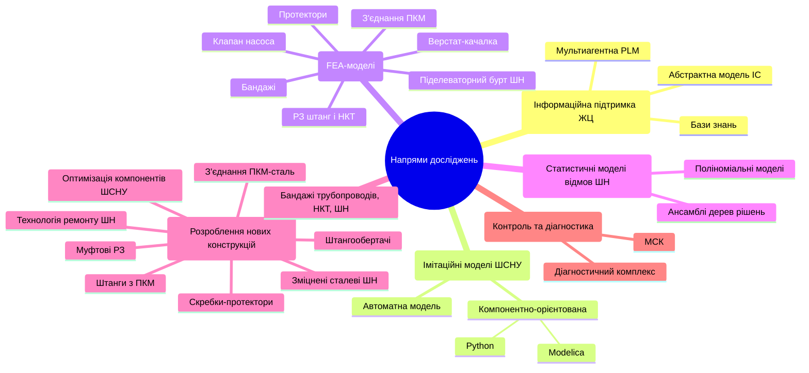

```mermaid
mindmap
  ((Напрями досліджень))
    (Інформаційна підтримка ЖЦ)
      Абстрактна модель ІС
      Мультиагентна PLM
      Бази знань
    (Імітаційні моделі ШСНУ)
      Автоматна модель
      Компонентно-орієнтована
        Modelica
        Python
    (FEA-моделі)
      РЗ штанг і НКТ
      З'єднання ПКМ
      Бандажі
      Протектори
      Клапан насоса
      Верстат-качалка
      Піделеваторний бурт ШН 
    (Статистичні моделі відмов ШН)
      Поліноміальні моделі
      Ансамблі дерев рішень
    (Розроблення нових конструкцій)
      Штанги з ПКМ
      Бандажі трубопроводів, НКТ, ШН
      З'єднання ПКМ-сталь
      Оптимізація компонентів ШСНУ 
      Муфтові РЗ
      Штангообертачі
      Скребки-протектори
      Зміцнені сталеві ШН
      Технологія ремонту ШН
    (Контроль та діагностика) 
      МСК
      Діагностичний комплекс
```
